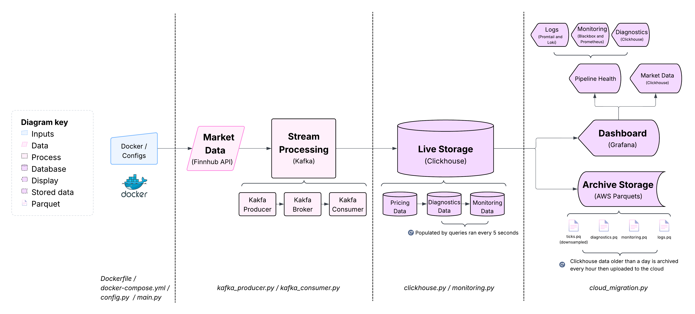

# THIS FILE HAS BEEN MODIFIED TO ONLY CONTAIN THE STORAGE COMPONENT! UPDATE DOCUMENTATION.

# Real-Time Market Data Pipeline

## Overview
A real-time market data pipeline for streaming, storing, monitoring, and visualizing financial tick data, designed as simplified recreation to systems used in trading environments. The pipeline is live and displayed on my personal website, www.erickopen.com. I continuously monitor and improve it in my free time.  

## Architecture
- **Configuration** This project is orchestrated via Docker and deployed on a Digital Ocean server. NGINX was used to display Grafana dashboards on www.erickopen.com.
- **Ingestion:** A Kafka producer connects to a Finnhub API websocket, which streams exchange data from Binance. This data is fed into a Kafka topic.  
- **Storage:** A Kafka consumer validates, batches, and inserts data into a ClickHouse table.  
- **Monitoring:** The pipeline itself is monitored via standard logging and a periodic diagnostic/monitoring queries (which are stored in seperate Clickhouse tables). Status of the Digital Ocean server and Docker are monitored by a variety of tools that feed into Prometheus.   
- **Archival:** Market data, logging data, and diagnostic/monitoring data gathered from the pipeline are archived to parquets after a day, which are then automatically uploaded to AWS S3 for long term storage.
- **Dashboard:** Grafana dashboards highlight various metrics related to the status of the server, Docker, and pipeline. Additionally, market data captured is displayed for informative purposes.

## Diagram

## Future Improvements
**Planned Features:**
- Expand data intake to include other websocket/api sources that all pull concurrently, broadening the asset classes, instruments, and breadth of information captured in the data stream.
- Create email alerts via Grafana for downtime, lag, or critical errors that occur in the pipeline.
- Track, benchmark, and optimize the performance of features like Kafka and Clickhouse to minimize lag.
- Build a module that uses the data stream to continiously retrain and implemenmt machine learning based trading strategies.
- Implement a CI/CD pipeline for automated testing and deployment.
- Once the complexity justifies it, introduce Kubernetes.
- Have Kafka run on a different server, as mixing it with Clickhouse is a bit inefficient.
 
**Known Issues:**
-  Log data appears to be inconsistenly sent to parquet format. Additionally, I am not sure if other Clickhouse tables are being saved as parquets when expired. Possibly due to configuration issues on Digital Ocean.
-  Verify Docker restart loop works via testing.
- There are time zone inconsistencies across different sources, apparent in Grafana. Make sure these are all in sync.
- Security is not optimal. I am using several default passwords that are pasted in my code.
- Disk space continues to grow over time, due to nuances with docker. May need to run a regular cron job: docker compose down && docker system prune -af --volumes && docker compose up -d
- Pipeline is shown to be down via prometheus but this is not accurate in reality.
- Visualization needs to show correct heartbeat frequency.

## Comments
- A small suite of unit tests is in the tests folder.
- In order to manage costs, the actual upload to S3 is deactivated

 