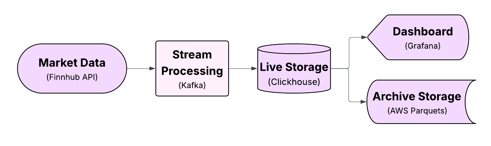

# Real-Time Market Data Pipeline

## Overview
A simplified, real-time market data pipeline for streaming, storing, monitoring, and visualizing financial tick data, similar to systems used in trading environments.  
Currently deployed via Docker on a DigitalOcean server.  

## Architecture
- **Ingestion:** Kafka producer streams live market data from an API into a Kafka topic.  
- **Storage:** Kafka consumer validates, batches, and inserts data into ClickHouse tables.  
- **Monitoring:** Metrics and logs are tracked with Prometheus, Loki, and Python logging.  
- **Archival:** Data is automatically backed up to AWS S3 for long-term storage.  
- **Dashboard:** Grafana provides real-time views of tick data and pipeline health.  
- **Deployment:** Docker Compose ensures reproducibility and simple scaling.  

## Tech Stack
 Docker • Python • Kafka • ClickHouse • Grafana  • Promtail/Loki • Blackbox/Prometheus • AWS S3  •  DigitalOcean DNS Hosting

## Tests
A small suite of unit tests is in the tests folder.

## Future Improvements
**Ingestion:**
-  Investigate log upload inconsistencies (potential error in the cloud migration file). Potentially all parquet file saves are broken.
-  Verify Docker restart loop works.
-  Make Grafana dashboards easier to migrate/port.
- fix time zone entries differing

**Planned Features:**
- Email alerts for downtime, lag, or critical errors.
-  Benchmark and optimize Kafka/ClickHouse performance.
-  Expand to bid/ask data and other asset classes or other datasources.
-  Add a portfolio/systemized ML strategy layer.
-  Implement a CI/CD pipeline for automated testing and deployment.

- documentation adding:
    cAdvisor
    DNS info
        mention the grafana set up with porting 
 
 